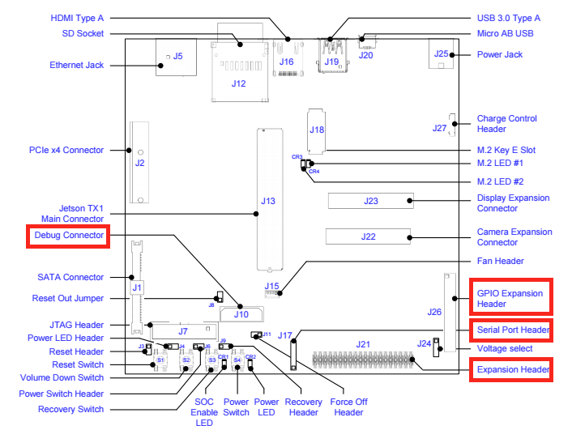

NVidia Jetson TX1 Companion Board
=================================

__Project: IRD Stereo Cameras__

__A. Marburg__

Introduction
------------

The 2016 SEG IRD Stereo Camera project is supporting the development of a low-cost
stand-alone stereo sensing head in a shallow water enclosure.   The sensor head
will provide stereo video including a dense depth estimate and will include
sufficient on-board processing power for realtime 3D reconstruction.

The sensor head consists for a [Stereolabs Zed](https://www.stereolabs.com/zed/specs/) USB3 stereo camera
and an [NVIdia Jetson TX1](http://www.nvidia.com/object/jetson-tx1-module.html)
embedded computer.   The Zed consists of a two-camera USB3 sensor unit and a
proprietary set of software libraries for interfacing with the sensor and
generating realtime dense stereo.  These libraries are accelerated using NVidia's CUDA technology.  The Jetson TX1 computer module contains four 64-bit ARM processor cores as well as a
256-CUDA core GPU, which allows the Jetson TX1 to run the Zed processing library.

The Jetson itself lives on a small (approx. credit card) carrier board, but for
development purposes a mini-itx 5" x 5" motherboard is provided which includes a number of
standardized connectors as well as expansion and debug headers.   While the 5"x5" form factor
is somewhat awkward for packaging, the motherboard greatly simplifies the bootstrapping of new projects.   Given complete schematics for the motherboard, more application-specific host boards
are theoretically possible.

The sensor package has a single connector which provides Cat6 UTP to the sensor head.  This cabling provides gigabit ethernet as well as 60W power-over-ethernet (PoE).  Note 60W PoE is
non-standard.

The standard motherboard has a number of features which are inconvenient when the board
is enclosed with limited access.  A companion board has been designed to
deal with some of these inconveniences and to provide a breakout for some of the more common
expansion headers on the Jetson motherboard.

Specification
-------------

The functional spec is outlined below:

<table>
<tr><th>First</th><th>Second</th><th>Third</th><th>Notes</th></tr>
<tr>
	<th rowspan=3>Manage Jetson Power/state</th><td>Enable auto power-on</td><td>Power on delay after startup</td><td>Use power button</td>
</tr>
<tr>
	<td>Provide an OOB way to reset the Jetson</td><td>Use reset button</td>
</tr>
<tr>
	<td>Deadman timer</td><td>Reset if no communications (I2C?) after period of time</td><td>Manual disable/override on deadman?</td>
</tr>
<tr>
	<th rowspan=2>Provide OOB communications</th><td>Reset the Jetson remotely</td><td>OOB connection to microcontroller?  Maybe magic pattern (break) to serial port?  Reset or power on.</td>
</tr>
<tr>
	<td>Access serial console</td><td>Wireless or IR?</td><td>Connection speed is 115200, with 8 bits, no parity, and 1 stop bit (115200 8N1). Flow control will be RTS/CTS.  3v3.  Apparently it's on J21 pins 8,10 (Jetson pins UART0_*), board siganls UART1_*_HDR_3V3.   J17 hosts TX1 signals UART1_*</td>
</tr>
<tr>
	<th rowspan=2>Host supplemental sensors</t><td>Pressure / temp sensor</td><td>Bosch BMP280</td><td>Adafruit (https://www.adafruit.com/products/2651) includes vreg and level shifters.  Don't need.</td>
</tr>
<tr>
	<td>Headers for supplemental temp sensors?</td><td>4 pin headers for VDD/Gnd/SDA/SCL for add'l I2C sensors</td>
</tr>
<tr>
	<th rowspan=2>Break out supplemental signals</th><td>GPIO Header (J26)</td><td>Pin headers</td>
</tr>
<tr>
	<td>Expansion Header (J21)</td><td>Serial port (J17)</td><td>Jetson TX1 USART1_* at 3V3</td>
</tr>
<tr>
	<th>Support for MSP430</th><td></td><td>Programming header</td>
</tr>
<tr>
	<th rowspan=2>Indicators</th><td>LEDs for ?</td><td>Deadman?</td>
</tr>
<tr>
	<td></td><td>Communications received?</td>
</tr>
<tr>
	<th>Standalone version of board  for debugging</th><td>LEDs for status/debug?</td>
</tr>
<tr>
	<th>Power board from Jetson?</th><td></td><td>3v3 is on all the time.</td>
</tr>
<tr>
	<th>Control BlueRobotics lights</th><td>Generate PWM</td><td></td><td>Turn off lights</td>
</tr
</table>

Electrical Design
------

The board accomplishes two primary functions.  First, it mates and provide breakouts to four of the expansion headers on the Jetson board:

Very briefly:

 * Debug connector (J10).   Power and reset, as well as JTAG, UART and I2C (not used).  Primarily at 1v8.
 * Expansion header (J21).  I2C, I2S, SPI, UART at 3v3.
 * GPIO (J26).   GPIOs, mostly, some I2S
 * Serial Port (J17).   Supplemental UART.  Notably, not the Jetson's console (this is on J21).

The companion board also hosts a MSP430 microprocessor.  As per the spec, this:

 * Turns the Jetson on when power is applied
 * Provides an OOB connection to reset the Jetson
 * Provides PWM control to the two Blue Robotics lights
 *

The board also hosts a pressure/temperature sensor (Bosch BMP280), which interfaces to the
I2C on the Jetson (not on the microprocessor) and an XBee radio.  The XBee provides
wireless connectivity to the Jetson's console and OOB to the microcontroller via DIO.

Firmware Design
-----

Software Interface on Jetson
------
