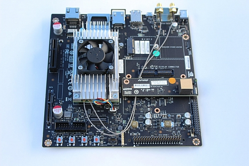

  This repo provides project- and system-level information about the MaSCOT project.  For a high-level overview, see [my blog](http://faculty.washington.edu/amarburg/site/mascot/)

Introduction
------------

The 2016 SEG IR&D Stereo Camera project is supporting the development of a low-cost
stereo camera head in a shallow water enclosure.   The sensor head
will provide stereo video including a dense depth estimate and will include
sufficient on-board processing power for realtime 3D reconstruction.

The sensor head consists of a [Stereolabs
Zed](https://www.stereolabs.com/zed/specs/) USB3 stereo camera and an [NVIdia
Jetson TX1](http://www.nvidia.com/object/jetson-tx1-module.html) embedded
computer.   The Zed consists of a two-camera USB3 sensor unit and a proprietary
set of software libraries for interfacing with the sensor and generating
realtime dense stereo.  These libraries are accelerated using NVidia's CUDA
technology.  The Jetson TX1 computer module contains four 64-bit ARM processor
cores as well as a 256-CUDA core GPU, which allows the Jetson TX1 to run the Zed
processing library.

The Jetson itself lives on a small (approx. credit card) carrier board, but for
development purposes a mini-itx 5" x 5" motherboard is provided which includes a
number of standardized connectors (SATA, Ethernet, SD card, PCI-E, mini-PCI-E)
as well as expansion and debug pin headers.   While the 5"x5" form factor is
somewhat awkward for packaging, the motherboard greatly simplifies the
bootstrapping of new projects.   Given that complete schematics for the
motherboard are available, more application-specific host boards are
theoretically possible.

The underwater enclosure package has a single Subconn 8-pin connector which
provides Cat6 UTP to the sensor head.  This cabling provides gigabit ethernet as
well as 60W power-over-ethernet (PoE).  Note 60W PoE is non-standard. This
connector allows reuse of existing subsea ethernet cables but prevents
supplemental functions going over the same cable (unless we put an Ethernet hub
in the box).      The package also includes two [BlueRobotic Lumen
1](https://www.bluerobotics.com/store/electronics/lumen-light-r1/) submersible
LED lights.

## Other repos

  * https://github.com/amarburg/mascot_companion_board contains schematics and firmware for the Jetson "companion board."
